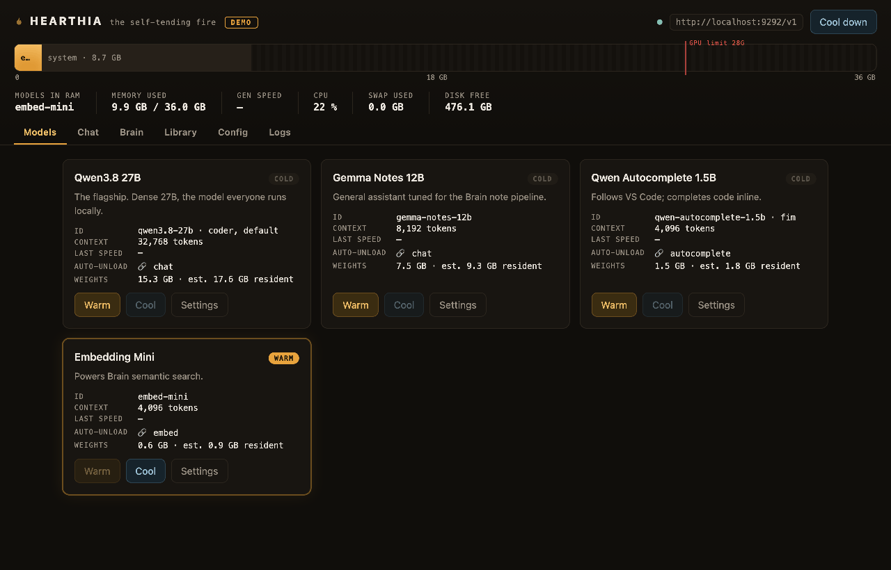
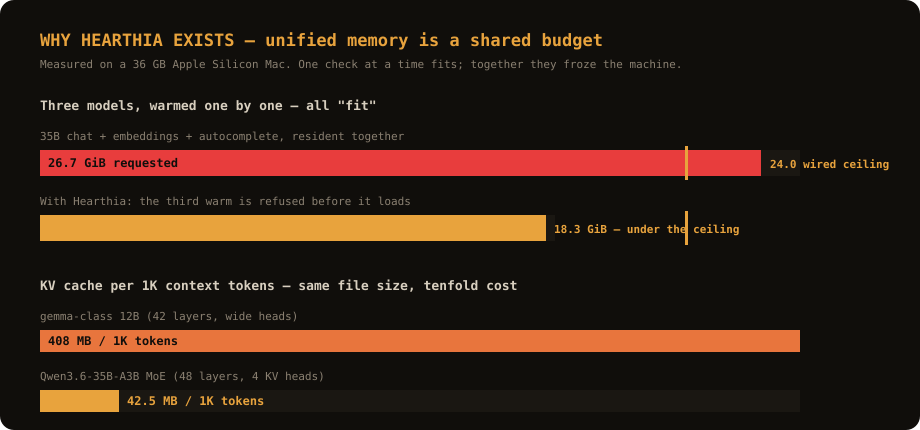
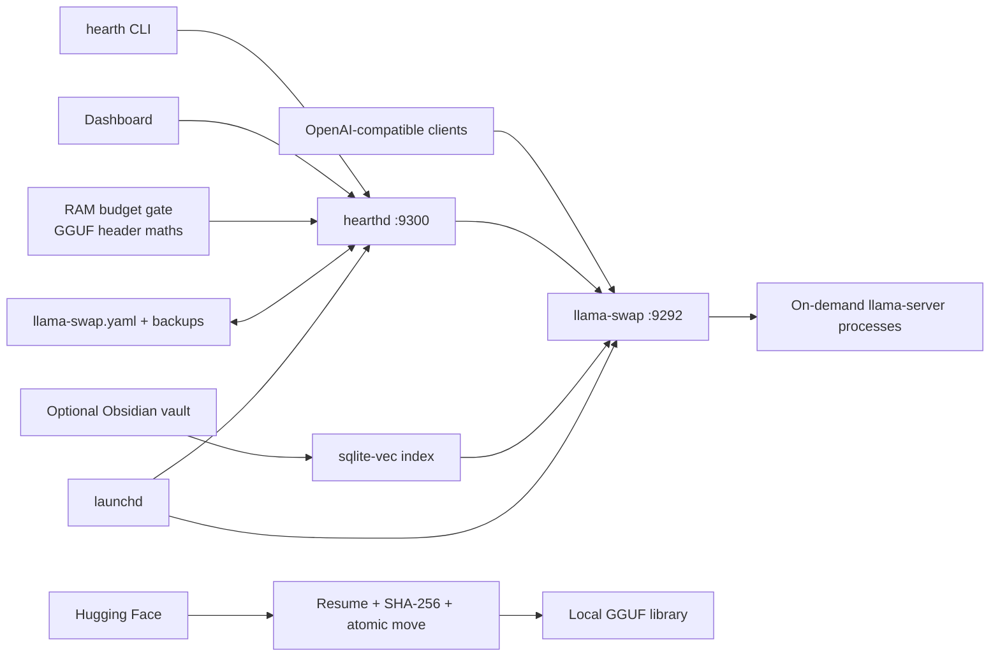

<p align="center">
  
</p>

<h1 align="center">Hearthia</h1>

<p align="center"><strong>The self-tending fire for local models.</strong></p>

<p align="center">
  A Mac-native control plane that turns llama.cpp models into an on-demand local service:<br>
  load on first use, unload when idle, and <strong>never exceed the unified-memory budget</strong>.<br>
  Built around the models people actually run — Qwen3.8-27B, Gemma, embeddings helpers — on one Apple Silicon Mac.
</p>

<p align="center">
  <a href="https://github.com/JesusMonjeGonzalez/hearthia/actions/workflows/ci.yml"></a>
  
  
  
  
</p>



<p align="center"><sub>The demo dashboard in motion: models warm, the unified-memory map fills, the chat streams. Regenerate it with <code>scripts/capture_demo.py</code>.</sub></p>

## See it in 30 seconds

No models, no llama.cpp, no setup — a fully synthetic stack served by the real dashboard:

```bash
uv tool install git+https://github.com/JesusMonjeGonzalez/hearthia.git
hearth demo
```

Warm the 30B coder, watch the memory map move, chat with it, cool everything
down. Everything is synthetic except the product.

## Why Hearthia

Running one local model is easy. Running several models without freezing an
Apple Silicon Mac is not: every context window, helper model and GPU buffer
competes for the same unified memory — and **wired memory cannot be paged
out**, so when models overfill it, the OS strangles everything else instead
of failing.

Hearthia is the missing operational layer around
[llama.cpp](https://github.com/ggml-org/llama.cpp) and
[llama-swap](https://github.com/mostlygeek/llama-swap):

| Problem | Hearthia's approach |
|---|---|
| Models consume RAM when nobody needs them | Cold models warm on request and cool after a TTL |
| Co-resident models silently freeze the Mac | **RAM budget gate**: every warm is checked against the wired ceiling before it loads |
| Helper models outlive the work they support | Role followers track the lifecycle of chat models and clients |
| Downloads fail halfway through | Resumable downloads, required SHA-256 verification and atomic finalization |
| Local stacks are hard to diagnose | One CLI and dashboard for health, RAM, logs, config and model state |
| Notes are disconnected from local models | Optional sqlite-vec search and resilient inbox capture for Obsidian |

## The RAM budget gate

Hearthia reads each model's **GGUF header** (layers, KV-head geometry, head
dimensions, training context) and computes the real resident footprint:
weights + KV cache at the configured context + compute buffers. A warm
request that would push the co-resident set past the GPU-wired ceiling is
**refused before it loads** — with the arithmetic printed:

```text
$ hearth warm gemma-notes-12b
kindling gemma-notes-12b…
  estimate  weights 8.1 + KV 5.6 GiB @ 32,768 tok ctx
  candidate gemma-notes-12b             13.5 GiB
  running   qwen-coder-30b              19.8 GiB  measured
  total      33.3 GiB of  28.0 GiB wired ceiling, 24.1 GiB available
gemma-notes-12b does not fit the unified-memory budget: 33.3 GiB needed,
28.0 GiB ceiling. Cool another model (hearth cool), lower --ctx-size, or use --force.
```

This is not a heuristic about file sizes. Two models of similar size can
differ **tenfold** in real cost, because the KV cache scales with layers,
KV heads and head dimensions — never with file size:



The gate is enforced in the CLI, the dashboard, and the lifecycle engine
(follower models never spawn over budget). Configure it in `config.toml`:

```toml
[memory]
mode = "enforce"   # enforce | warn | off
```

Measure your own stack with the bundled benchmark:

```bash
uv run scripts/benchmark.py
```

## What It Includes

- **`hearth` CLI:** status, warm/cool (budget-checked), downloads, service control, logs and diagnostics.
- **Dashboard:** model cards, memory map, TTL state, streaming chat, library, config and logs.
- **Lifecycle daemon:** observes gateway events, followers and crash loops.
- **Round-trip configuration:** edits `llama-swap.yaml` without destroying comments and rotates backups.
- **Local Brain:** indexes an optional Obsidian vault with sqlite-vec and local embeddings.
- **Loopback-only services:** the daemon rejects non-loopback binds and rejects foreign browser origins.

## Architecture



Hearthia does not replace the inference engine. llama.cpp runs each model and
llama-swap provides the compatible gateway; Hearthia manages their local
lifecycle and presents one operational surface.

## Requirements

- Apple Silicon Mac running macOS 14 or newer.
- Python 3.12+, [uv](https://docs.astral.sh/uv/) and Homebrew.
- `llama.cpp` and `llama-swap` installed in the Homebrew ARM prefix.
- A valid llama-swap model configuration and enough disk/RAM for the chosen GGUF files.

## Quick Start

Install the native dependencies and Hearthia directly from GitHub:

```bash
brew install llama.cpp llama-swap
brew install uv
uv tool install git+https://github.com/JesusMonjeGonzalez/hearthia.git
```

Create Hearthia's stack directory and provide a llama-swap configuration:

```bash
mkdir -p ~/.hearthia/models
$EDITOR ~/.hearthia/llama-swap.yaml
```

A minimal starting point looks like this:

```yaml
healthCheckTimeout: 180

models:
  local-model:
    name: Local model
    cmd: |
      /opt/homebrew/bin/llama-server
      --port ${PORT}
      --model /absolute/path/to/model.gguf
      --ctx-size 8192
      --n-gpu-layers 999
    ttl: 300
```

Install the launchd services and verify them:

```bash
hearth install
hearth doctor
hearth status
open http://127.0.0.1:9300
```

`hearth install` creates user LaunchAgents for the gateway and dashboard. It
also installs a weekly Homebrew update job for llama.cpp; inspect the
rendered services before enabling them on a production workstation.

A Homebrew formula is provided in [`packaging/hearthia.rb`](packaging/hearthia.rb)
(tap it with `brew tap-new` + `brew install ./packaging/hearthia.rb`), and a
one-line installer at [`packaging/install.sh`](packaging/install.sh):

```bash
curl -fsSL https://raw.githubusercontent.com/JesusMonjeGonzalez/hearthia/main/packaging/install.sh | sh
```

## Everyday Use

```bash
hearth models
hearth est qwen-coder-30b gemma-notes-12b   # what-if: fits together? nothing loads
hearth warm local-model          # budget-checked; --force overrides
hearth cool --all
hearth pull owner/model-GGUF --quant Q4_K_M --add
hearth status                    # resident RAM, tok/s, TTL countdowns, budget
hearth logs -f
hearth doctor
```

Planning a loadout before committing RAM (Qwen3.8-27B, the local-class
flagship, plus an embeddings model — on a 36 GB Mac):

```text
$ hearth est qwen3.8-27b qwen3-embedding-0.6b
  qwen3.8-27b                        21.7 GiB  weights 16.4 + KV 4.6 GiB @ 65,536 tok ctx
  qwen3-embedding-0.6b                1.1 GiB  weights 0.6 + KV 0.2 GiB @ 4,096 tok ctx
  total                              22.8 GiB  of 28.0 GiB wired / 26.3 GiB available
  ✔ FITS
```

Lower a context (`hearth est ... --ctx 8192`) or add a third model and the
verdict changes before you touch memory.

## Bring the models you already have

Switching runtimes shouldn't mean re-downloading 20 GB. Hearthia adopts
GGUF weights that are already on disk — with their **real** RAM cost, from
the headers:

```bash
hearth adopt-ollama              # every model Ollama has pulled, by name
hearth adopt-ollama --add        # → written into llama-swap.yaml, budget-managed
hearth scan ~/.lmstudio/models   # LM Studio, or any folder of GGUFs
hearth scan --add                # probe the usual runtimes and adopt everything
```

Ollama keeps every model resident until you kill it by hand. Hearthia warms
on first use, cools after an idle TTL, and refuses loads that would exceed
the wired ceiling — the same weights, under a memory discipline.

More integrations (Zed, Continue.dev, OpenCode, Obsidian) live in
[`docs/RECIPES.md`](docs/RECIPES.md).

OpenAI-compatible clients use:

```text
Base URL: http://127.0.0.1:9292/v1
API key:  any non-empty local value
Model:    an ID or alias from llama-swap.yaml
```

## Configuration And Data

| Location | Purpose |
|---|---|
| `~/.config/hearthia/config.toml` | Hearthia settings (incl. `[memory] mode`) |
| `~/.hearthia/llama-swap.yaml` | Gateway and model definitions |
| `~/.hearthia/models/` | Local GGUF weights |
| `~/.hearthia/logs/` | Gateway, daemon and update logs |
| `~/.hearthia/backups/` | Rotating YAML backups |

`HEARTHIA_CONFIG` selects another TOML file. Nested settings can also be
overridden with variables such as `HEARTHIA_MEMORY__MODE=warn`.

## Security Boundary

- Hearthia is a **single-user local tool**, not a multi-user server.
- Services are enforced to loopback and do not implement user authentication; remote binding is rejected.
- Chat filesystem tools can read/search paths available to the local process; write operations are disabled.
- Model-fit estimates are header-derived and conservative, but the wired-limit ceiling is the enforced guarantee — verify real memory pressure when using `--force`.
- Model behavior and compatibility depend on the installed llama.cpp/llama-swap versions.

## Development And Evidence

```bash
git clone https://github.com/JesusMonjeGonzalez/hearthia.git
cd hearthia
uv sync
uv run ruff check .
uv run ruff format --check .
uv run mypy src
uv run pytest
```

CI runs the same static checks and Python suite on macOS. The optional browser
smoke test requires a live daemon and a Playwright browser installation:

```bash
uvx --from playwright python tests/e2e/smoke.py
```

## Current Limits

- macOS, Apple Silicon and launchd only.
- No authentication or remote multi-user deployment model; this is intentionally a local single-user tool.
- Real model loading is not exercised by unit CI.
- The budget gate blocks on GGUF-header maths; models with unreadable headers fall back to a file-size guess with a warning instead of a hard guarantee.
- No signed binary release; installation currently uses Python tooling and Homebrew.

See [`CHANGELOG.md`](CHANGELOG.md) for implemented milestones and
[`docs/ROADMAP.md`](docs/ROADMAP.md) for remaining work.

See the [security policy](SECURITY.md), the
[contributing guide](CONTRIBUTING.md) and
[third-party notices](THIRD_PARTY_NOTICES.md).
Hearthia is released under the [MIT License](LICENSE).
