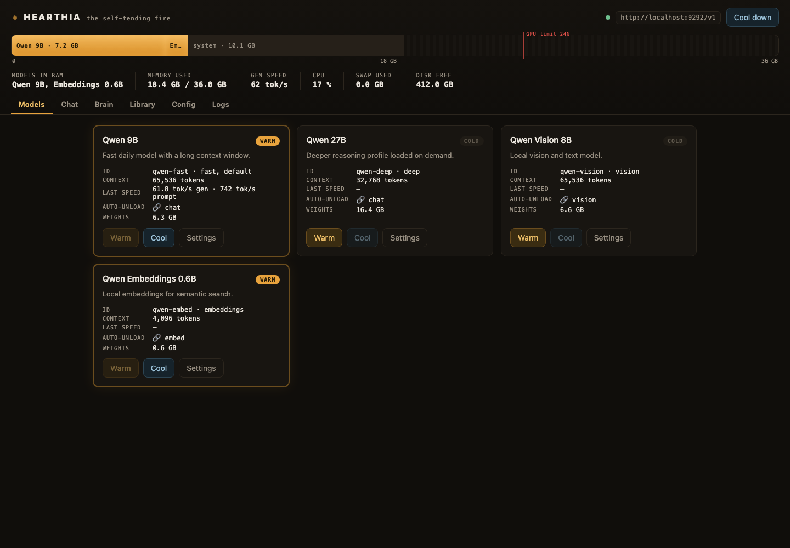
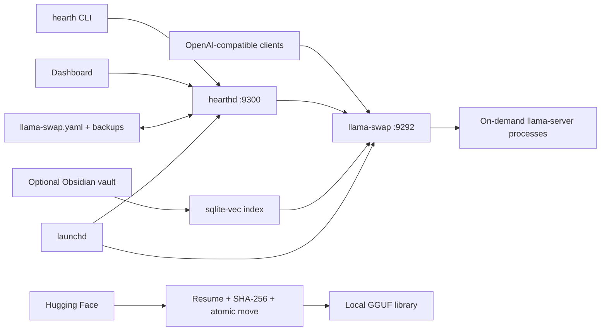

<p align="center">
  
</p>

<h1 align="center">Hearthia</h1>

<p align="center"><strong>The self-tending fire for local models.</strong></p>

<p align="center">
  A Mac-native control plane that turns llama.cpp models into an on-demand local service:<br>
  load on first use, unload when idle, and stay inside a unified-memory budget.
</p>

<p align="center">
  <a href="https://github.com/JesusMonjeGonzalez/hearthia/actions/workflows/ci.yml"></a>
  
  
  
</p>



<p align="center"><sub>Real dashboard UI with a synthetic demo state. No local configuration or model inventory is shown.</sub></p>

## Why Hearthia

Running one local model is easy. Running several models without freezing an
Apple Silicon Mac is not: every context window, helper model and GPU buffer
competes for the same unified memory.

Hearthia adds the missing operational layer around
[llama.cpp](https://github.com/ggml-org/llama.cpp) and
[llama-swap](https://github.com/mostlygeek/llama-swap):

| Problem | Hearthia's approach |
|---|---|
| Models consume RAM when nobody needs them | Cold models warm on request and cool after a TTL |
| Helper models outlive the work they support | Role followers track the lifecycle of chat models and clients |
| Downloads fail halfway through | Resumable downloads, SHA-256 verification and atomic finalization |
| Local stacks are hard to diagnose | One CLI and dashboard for health, RAM, logs, config and model state |
| Notes are disconnected from local models | Optional sqlite-vec search and resilient inbox capture for Obsidian |

## What It Includes

- **`hearth` CLI:** status, warm/cool, downloads, service control, logs and diagnostics.
- **Dashboard:** model cards, memory map, TTL state, streaming chat, library, config and logs.
- **Lifecycle daemon:** observes gateway events, followers and crash loops.
- **Round-trip configuration:** edits `llama-swap.yaml` without destroying comments and rotates backups.
- **Local Brain:** indexes an optional Obsidian vault with sqlite-vec and local embeddings.
- **Loopback-first services:** the dashboard binds to `127.0.0.1` and rejects foreign browser origins.

## Architecture



Hearthia does not replace the inference engine. llama.cpp runs each model and
llama-swap provides the compatible gateway; Hearthia manages their local
lifecycle and presents one operational surface.

## Requirements

- Apple Silicon Mac running macOS 14 or newer.
- Python 3.12+, [uv](https://docs.astral.sh/uv/) and Homebrew.
- `llama.cpp` and `llama-swap` installed in the Homebrew ARM prefix.
- A valid llama-swap model configuration and enough disk/RAM for the chosen GGUF files.

## Quick Start

Install the native dependencies and Hearthia directly from GitHub:

```bash
brew install llama.cpp llama-swap
brew install uv
uv tool install git+https://github.com/JesusMonjeGonzalez/hearthia.git
```

Create Hearthia's stack directory and provide a llama-swap configuration:

```bash
mkdir -p ~/.hearthia/models
$EDITOR ~/.hearthia/llama-swap.yaml
```

A minimal starting point looks like this:

```yaml
healthCheckTimeout: 180

models:
  local-model:
    name: Local model
    cmd: |
      /opt/homebrew/bin/llama-server
      --port ${PORT}
      --model /absolute/path/to/model.gguf
      --ctx-size 8192
      --n-gpu-layers 999
    ttl: 300
```

Install the launchd services and verify them:

```bash
hearth install
hearth doctor
hearth status
open http://127.0.0.1:9300
```

`hearth install` creates user LaunchAgents for the gateway and dashboard. It
also installs a weekly Homebrew update job for llama.cpp; inspect the
rendered services before enabling them on a production workstation.

## Everyday Use

```bash
hearth models
hearth warm local-model
hearth cool --all
hearth pull owner/model-GGUF --quant Q4_K_M --add
hearth logs -f
hearth doctor
```

OpenAI-compatible clients use:

```text
Base URL: http://127.0.0.1:9292/v1
API key:  any non-empty local value
Model:    an ID or alias from llama-swap.yaml
```

## Configuration And Data

| Location | Purpose |
|---|---|
| `~/.config/hearthia/config.toml` | Hearthia settings |
| `~/.hearthia/llama-swap.yaml` | Gateway and model definitions |
| `~/.hearthia/models/` | Local GGUF weights |
| `~/.hearthia/logs/` | Gateway, daemon and update logs |
| `~/.hearthia/backups/` | Rotating YAML backups |

`HEARTHIA_CONFIG` selects another TOML file. Nested settings can also be
overridden with variables such as `HEARTHIA_DAEMON__PORT`.

## Security Boundary

- Hearthia is a **single-user local tool**, not a multi-user server.
- Services bind to loopback by default and do not implement user authentication.
- Chat filesystem tools can read/search paths available to the local process; write operations are disabled.
- Model-fit estimates are advisory. Verify real memory pressure before increasing context or co-residency.
- Model behavior and compatibility depend on the installed llama.cpp/llama-swap versions.

## Development And Evidence

```bash
git clone https://github.com/JesusMonjeGonzalez/hearthia.git
cd hearthia
uv sync
uv run ruff check .
uv run ruff format --check .
uv run mypy src
uv run pytest
```

CI runs the same static checks and Python suite on macOS. The optional browser
smoke test requires a live daemon and a Playwright browser installation:

```bash
uvx --from playwright python tests/e2e/smoke.py
```

## Current Limits

- macOS, Apple Silicon and launchd only.
- No authentication or remote multi-user deployment model.
- Real model loading is not exercised by unit CI.
- The detailed RAM estimator is not yet enforced on every warm request.
- No signed binary release; installation currently uses Python tooling and Homebrew.

See [`CHANGELOG.md`](CHANGELOG.md) for implemented milestones and
[`docs/ROADMAP.md`](docs/ROADMAP.md) for remaining work.
