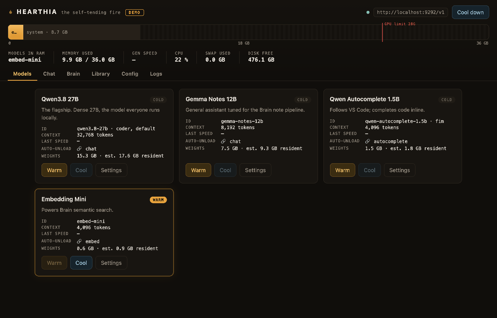
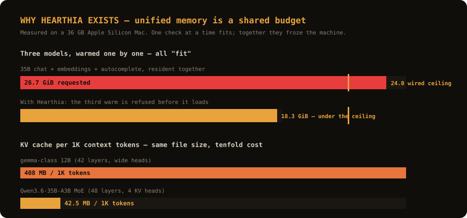
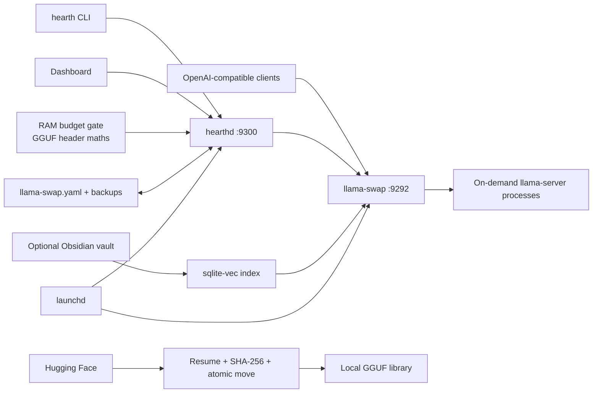

<p align="center">
  
</p>

<h1 align="center">Hearthia</h1>

<p align="center"><strong>The self-tending fire for local models.</strong></p>

<p align="center">
  A Mac-native control plane that turns llama.cpp models into an on-demand local service:<br>
  load on first use, unload when idle, and <strong>check loads against a unified-memory budget</strong>.<br>
  Built around the models people actually run — Qwen3.8-27B, Gemma, embeddings helpers — on one Apple Silicon Mac.
</p>

<p align="center">
  <a href="https://github.com/JesusMonjeGonzalez/hearthia/actions/workflows/ci.yml"></a>
  <a href="https://github.com/JesusMonjeGonzalez/hearthia/releases/tag/v0.7.0"></a>
  
  
  
  
</p>



<p align="center"><sub>The demo dashboard in motion: models warm, the unified-memory map fills, the chat streams. Regenerate it with <code>scripts/capture_demo.py</code>.</sub></p>

## See it in 30 seconds

No models, no llama.cpp, no setup — a fully synthetic stack served by the real dashboard:

```bash
uv tool install git+https://github.com/JesusMonjeGonzalez/hearthia.git
hearth demo
```

Warm the 30B coder, watch the memory map move, chat with it, cool everything
down. Everything is synthetic except the product.

## Why Hearthia

Running one local model is easy. Running several models without freezing an
Apple Silicon Mac is not: every context window, helper model and GPU buffer
competes for the same unified memory — and **wired memory cannot be paged
out**, so when models overfill it, the OS strangles everything else instead
of failing.

Hearthia is the missing operational layer around
[llama.cpp](https://github.com/ggml-org/llama.cpp) and
[llama-swap](https://github.com/mostlygeek/llama-swap):

| Problem | Hearthia's approach |
|---|---|
| Models consume RAM when nobody needs them | Cold models warm on request and cool after a TTL |
| Co-resident models silently freeze the Mac | **RAM budget gate**: every warm is checked against the wired ceiling before it loads |
| Helper models outlive the work they support | Role followers track the lifecycle of chat models and clients |
| Downloads fail halfway through | Resumable downloads, required SHA-256 verification and atomic finalization |
| Local stacks are hard to diagnose | One CLI and dashboard for health, RAM, logs, config and model state |
| Notes are disconnected from local models | Optional sqlite-vec search and resilient inbox capture for Obsidian |

## The RAM budget gate

Hearthia reads each model's **GGUF header** (layers, KV-head geometry, head
dimensions, training context) and computes the real resident footprint:
weights + KV cache at the configured context + compute buffers. A warm
request that would push the co-resident set past the GPU-wired ceiling is
**refused before it loads** — with the arithmetic printed:

```text
$ hearth warm gemma-notes-12b
kindling gemma-notes-12b…
  estimate  weights 8.1 + KV 5.6 GiB @ 32,768 tok ctx
  candidate gemma-notes-12b             13.5 GiB
  running   qwen-coder-30b              19.8 GiB  measured
  total      33.3 GiB of  28.0 GiB wired ceiling, 24.1 GiB available
gemma-notes-12b does not fit the unified-memory budget: 33.3 GiB needed,
28.0 GiB ceiling. Cool another model (hearth cool), lower --ctx-size, or use --force.
```

This is not a heuristic about file sizes. Two models of similar size can
differ **tenfold** in real cost, because the KV cache scales with layers,
KV heads and head dimensions — never with file size:



The arithmetic — GGUF header reader, KV-cache bytes, resident-RAM estimate,
set-fits check — lives inside Hearthia (pure Python, no extra dependencies)
and is exposed directly: price any GGUF on disk, even one not in your
config, without touching a gateway:

```bash
$ hearth gguf ~/models/Cydonia-24B-Q4_K_M.gguf --ctx 32768
Cydonia-24B-Q4_K_M.gguf
  architecture geometry : 40 layers · 8 KV heads · 128+128 head dims
  weights 13.3 + KV 2.7 GiB @ 32,768 tok ctx
  KV cost per 1K tokens : 85.0 MiB
  resident estimate     : 16.7 GiB
```

The gate is enforced in the CLI, the dashboard, and the lifecycle engine
(follower models never spawn over budget). Configure it in `config.toml`:

The estimator also **learns**: once a model has stayed warm long enough to
settle, Hearthia compares its header estimate against the real measured RSS
and folds the disagreement into a persisted per-model correction factor —
so later estimates for that exact GGUF get more accurate the more it is
actually run on this Mac.

```bash
$ hearth calibration
  qwen-coder-30b               x1.14  (3 sample(s), header under-estimated)  last measured 22.6 GiB vs estimated 19.8 GiB
```

No other local-model runtime (Ollama, LM Studio, llama-swap) reconciles its
own footprint estimate against reality, let alone remembers the correction
between runs.

```toml
[memory]
mode = "enforce"   # enforce | warn | off
```

Measure your own stack with the bundled benchmark:

```bash
uv run scripts/benchmark.py
```

## What It Includes

- **`hearth` CLI:** status, warm/cool (budget-checked), downloads, service control, logs and diagnostics.
- **`hearth doctor`:** read-only full-system check (config, files, services, memory
  fit, disk, DB integrity, MCP servers) with `--json` and a non-zero exit on failure;
  never loads a model.
- **`hearth tune`:** read-only speed/cost advice from measured data — spec-decode acceptance,
  KV vs `--cache-ram`, prompt-cache reuse and observed context peaks.
- **Residency policy:** one large model at a time, small helpers under a size cap, a non-wired RAM reserve kept free for macOS and every other app, swap-in-use warnings and fail-closed behaviour when the resident set is unknown. Every decision prints its measured inputs. See [`docs/MEMORY-POLICY.md`](docs/MEMORY-POLICY.md).
- **Dashboard:** model cards, memory map, TTL state, streaming chat, library, config, logs and a read-only TreePact panel.
- **Persistent project chat:** SQLite transcripts with partial-output recovery, tool history, workspace/AGENTS.md context, paginated browsing, browser-history import and full Markdown export. Filesystem tools run in disposable, cancellable workers. See [`docs/CHAT-HARNESS.md`](docs/CHAT-HARNESS.md).
- **Cache-friendly prompts and token data:** one packing decision per turn, append-only
  rounds, volatile project context in the tail so llama.cpp can reuse its prompt cache,
  llama.cpp `timings` (prefill, `cache_n`, tok/s) surfaced in chat and stored per message,
  and `?format=json` transcript export for other agents. See [`docs/TOKEN-EFFICIENCY.md`](docs/TOKEN-EFFICIENCY.md).
- **Cheap edit verification:** edited Python/JSON/TOML is parsed locally; a broken file
  reaches the model as a compact note in the same round, at no token cost when clean.
- **Re-reads stay cheap:** a byte-identical file already in the prompt is answered with
  a note (sha256-checked), not resent; range reads and changed files always read in full.
- **Search all messages:** SQLite FTS5 across every conversation with highlighted
  snippets and jump-to-hit; zero model tokens. Falls back to a LIKE scan without FTS5.
- **Retry, fork and verification:** re-run the last question in a fresh copy, branch any
  conversation, and see at a glance when a turn edited files without running a check.
- **Per-edit checks:** run the project's own linter/checker after edits (configurable
  per extension); passes cost ~10 tokens, failures return bounded diagnostics.
- **Verification gate:** a plan step cannot be marked done in a turn that edited files
  without running a command afterwards — warned by default, refused with
  `require_verification = true`.
- **Background jobs:** long commands run detached with a log file; the chat polls a
  bounded tail and can wait or stop them. Bounded count, lifetime, log size and cleanup.
- **Hot config reload:** `POST /api/config/reload` applies agent/memory/MCP changes with
  a diff report, without restarting the daemon.
- **Hooks:** fire-and-forget commands on `turn_end`/`edit` (notifications, formatters)
  with a JSON payload on stdin — bounded, logged, never in the turn's way.
- **Optional model compaction:** `[agent] compaction = "model"` keeps a rolling, 200-word
  model summary of dropped turns (background, bounded, digest as fallback).
- **Shortcuts and honest errors:** Esc stops a turn, Cmd/Ctrl+K starts a new chat;
  a down gateway tells you the one command that fixes it.
- **Usage panel:** tokens per conversation (input vs allowance, totals, growth/turn,
  projected turns to trimming, last-round cache and tok/s) at zero token cost.
- **Readable transcript:** every reply shows which model produced it (with tok/s), and
  `task`/`job`/`plan`/MCP results get structured cards instead of raw text.
- **Subagents on a small model:** `[agent] subagent_model` offloads exploration to a
  1.5B helper (RAM-policy-checked, falls back to the main model with a stated reason).
- **Subagents:** the `task` tool runs read-only exploration in a disposable context
  and returns a bounded report — file dumps and test logs stay out of the main
  64K window. See [`docs/SUBAGENTS.md`](docs/SUBAGENTS.md).
- **Autonomous runs:** plan statuses (`done`) with an `n/m` checklist, an opt-in
  auto-continue that follows pending steps (capped, interruptible), and digests that keep
  conclusions when turns are dropped.
- **Long autonomous sessions:** keepalive against TTL eviction, round/time budgets,
  a pinned `update_plan` that survives context trimming, and a no-progress guard.
  See [`docs/LONG-SESSIONS.md`](docs/LONG-SESSIONS.md).
- **Develop mode:** exact file edits, no-overwrite file creation and foreground commands with real exit codes, bounded output, deadlines and sampled RSS limits. Review diffs and test results in the transcript. See [`docs/CODING-AGENT.md`](docs/CODING-AGENT.md).
- **Lifecycle daemon:** observes gateway events, followers and crash loops.
- **Round-trip configuration:** edits `llama-swap.yaml` without destroying comments and rotates backups.
- **Local Brain:** indexes an optional Obsidian vault with sqlite-vec and local embeddings.
- **Loopback-only services:** the daemon rejects non-loopback binds and rejects foreign browser origins.
- **MCP server:** agents (OpenCode, Zed, Claude…) manage warm/cool/est/Brain search themselves — budget-enforced. See [`docs/MCP.md`](docs/MCP.md).
- **MCP client:** the chat consumes tools from your own stdio MCP servers, namespaced as
  `mcp__<server>__<tool>`, opt-in via `[mcp.servers.*]`, with deadlines, bounded schemas/output
  and read-only servers visible to Consult mode. See [`docs/MCP-CLIENT.md`](docs/MCP-CLIENT.md).
- **TreePact facade:** humans can launch governed coding-agent runs through
  `hearth treepact` and review status, diffs and evidence through bounded
  read-only commands. The dashboard's **TreePact** tab and `GET
  /api/treepact/*` show the same data through TreePact's own strict,
  versioned `review` contract — never a database Hearthia opens itself.
  TreePact remains the independent authority for worktrees, gates and
  evidence. See [`docs/TREEPACT.md`](docs/TREEPACT.md).
- **Loadouts & advisor:** `hearth loadout load coding` warms a named set under one whole-set check; `hearth loadout cool coding` preserves models shared by another declared loadout; `hearth advise` proposes KV-quantisation/context/cooling change-sets when a set doesn't fit.
- **Self-calibrating memory model:** `hearth calibration` learns a per-model correction between the header estimate and real measured RSS. See [The RAM budget gate](#the-ram-budget-gate).
- **GGUF license & provenance inspector:** `hearth provenance <model>` reads license, base model and source metadata straight from the GGUF header — no network access, no assumed fields.
- **Battery/thermal-aware budget:** `hearth power` shows the current state; a near-empty battery or active thermal throttling flexes the wired ceiling down for `hearth warm` and the dashboard's Warm button.
- **Model drift detection:** a re-quantized or replaced GGUF is caught by its changed `(size, mtime)` fingerprint the next time it warms, and its stale RAM calibration is dropped instead of trusted.
- **Predictive idle forecast:** `hearth status` and the dashboard (🔮) show whether a model is likely to see more activity before its TTL idles it out, learned from its own recent usage gaps.
- **Shadow-eval health gate:** `hearth warm --verify` / `hearth verify <model>` fire a real canary completion after a warm — an HTTP health check alone cannot see a broken chat template or a `--ctx-size` overflow.
- **GGUF weight dedupe:** `hearth dedupe [--link]` finds byte-identical GGUFs across Hearthia, Ollama and LM Studio folders and reclaims the duplicated disk space with hardlinks.
- **Loadout drift advisor:** a re-quantized or replaced model automatically re-checks every loadout that references it, surfaced at `GET /api/drift-warnings` and in `hearth doctor`.
- **Loadout session replay:** `hearth sessions list|replay` remembers stable combinations of models that were warm together and replays one with a single command.
- **Real token usage ledger:** `hearth usage` persists llama.cpp's own `--metrics` token counters per model, surviving restarts — measured, not estimated.
- **Context right-sizing advisor:** `hearth rightsize` suggests a lower `--ctx-size` from llama.cpp's real `n_tokens_max` high-water mark, with the GiB it would free.
- **Speculative-decoding acceptance advisor:** `hearth spec-decode` flags draft-model configs with a low real acceptance rate — drafting overhead without a real speedup.
- **Config lint:** `hearth lint` checks `--ctx-size` against a model's trained context, alias collisions, missing weights, and loadout/lifecycle rules referencing unknown models.
- **Warm-time ETA predictor:** `hearth warm` predicts how long it will take from real past durations.
- **Sleep prevention while warm:** holds a standard `caffeinate` process for as long as any model is warm.
- **Storage hygiene advisor:** `hearth storage` flags model weights unused for 30+ days.
- **Fleet health rehearsal:** `hearth rehearse` canary-checks every cold model, then cools it back down.
- **Log workbench:** filter lines, pause the view while the stream keeps buffering,
  and export the visible text locally. History is bounded to the latest 200,000 characters.

## Architecture


```mermaid
flowchart LR
    Clients[OpenAI-compatible clients] --> Gateway[llama-swap :9292]
    CLI[hearth CLI] --> Daemon[hearthd :9300]
    UI[Dashboard] --> Daemon
    Daemon --> Gateway
    Budget[RAM budget gate<br>GGUF header maths] --> Daemon
    Gateway --> Models[On-demand llama-server processes]
    Registry[llama-swap.yaml + backups] <--> Daemon
    HF[Hugging Face] --> Downloads[Resume + SHA-256 + atomic move]
    Downloads --> ModelsDir[Local GGUF library]
    Vault[Optional Obsidian vault] --> Index[sqlite-vec index]
    Index --> Gateway
    Launchd[launchd] --> Gateway
    Launchd --> Daemon
```

Hearthia does not replace the inference engine. llama.cpp runs each model and
llama-swap provides the compatible gateway; Hearthia manages their local
lifecycle and presents one operational surface.

## Requirements

- Apple Silicon Mac running macOS 14 or newer.
- Python 3.12+, [uv](https://docs.astral.sh/uv/) and Homebrew.
- `llama.cpp` and `llama-swap` installed in the Homebrew ARM prefix.
- A valid llama-swap model configuration and enough disk/RAM for the chosen GGUF files.

## Quick Start

One command installs the dependencies, Hearthia and the background services:

```bash
git clone https://github.com/JesusMonjeGonzalez/hearthia.git && cd hearthia
./scripts/install.sh          # add --check to only report what is missing
```

It installs `uv`, `llama.cpp` and `llama-swap` through Homebrew when missing,
installs the tool with `uv tool install`, registers the launchd services and
opens the chat. Manual equivalent, if you prefer it step by step:

```bash
brew install llama.cpp llama-swap uv
uv tool install git+https://github.com/JesusMonjeGonzalez/hearthia.git
hearth install && hearth
```

Create Hearthia's stack directory and provide a llama-swap configuration:

```bash
mkdir -p ~/.hearthia/models
$EDITOR ~/.hearthia/llama-swap.yaml
```

A minimal starting point looks like this:

```yaml
healthCheckTimeout: 180

models:
  local-model:
    name: Local model
    cmd: |
      /opt/homebrew/bin/llama-server
      --port ${PORT}
      --model /absolute/path/to/model.gguf
      --ctx-size 8192
      --n-gpu-layers 999
    ttl: 300
```

Install the launchd services and verify them:

```bash
hearth install
hearth doctor
hearth status
open http://127.0.0.1:9300
```

`hearth install` creates user LaunchAgents for the gateway and dashboard. It
also installs a weekly Homebrew update job for llama.cpp; inspect the
rendered services before enabling them on a production workstation.

A Homebrew formula is provided in [`packaging/hearthia.rb`](packaging/hearthia.rb)
(tap it with `brew tap-new` + `brew install ./packaging/hearthia.rb`), and a
one-line installer at [`packaging/install.sh`](packaging/install.sh):

```bash
curl -fsSL https://raw.githubusercontent.com/JesusMonjeGonzalez/hearthia/main/packaging/install.sh | sh
```

## One command to the agent

```bash
hearth chat -m qwen3.8-27b-rvn -w ~/my-project        # warm + open the chat, preselected
hearth chat --no-warm --no-open                        # just print the deep link
```

`hearth chat` starts whatever is not running, waits for the daemon, preloads
the model through the RAM gate (alias-resolved, skipped with `--no-warm`;
`[chat] default_model` sets the default) and opens the dashboard deep-linked
so the chat tab, project directory, model and mode are already set.

## Everyday Use

```bash
hearth models
hearth est qwen-coder-30b gemma-notes-12b   # what-if: fits together? nothing loads
hearth advise qwen-coder-30b gemma-notes-12b  # doesn't fit? change-sets that do
hearth gguf ~/models/model.gguf  # header-only cost report for any GGUF on disk
hearth loadout load coding       # warm a named set under one budget check
hearth warm local-model          # budget-checked; --force overrides
hearth cool --all
hearth pull owner/model-GGUF --quant Q4_K_M --add   # refuses if the disk can't hold it
hearth status                    # resident RAM, tok/s, TTL countdowns, budget
hearth logs -f
hearth doctor

# self-tuning & diagnostics (v0.5.0)
hearth calibration               # learned RAM-estimate correction from real warms
hearth provenance <model>        # license + lineage straight from the GGUF header
hearth lint                      # config vs real GGUF headers: ctx overrun, aliases, missing files
hearth usage                     # real lifetime token counts (needs --metrics on the model)
hearth rightsize                 # suggest a lower --ctx-size from real observed usage
hearth spec-decode               # draft-model acceptance rate
hearth storage                   # disk footprint per model, stale weights flagged
hearth rehearse                  # canary-check every cold model, then cool it back down
hearth power                     # battery/thermal state and its RAM ceiling reduction
hearth dedupe --link             # reclaim disk from byte-identical GGUFs across runtimes
hearth sessions list|replay      # replay a past combination of warm models
hearth verify <model>            # real-completion check on an already-warm model
```

Planning a loadout before committing RAM (Qwen3.8-27B, the local-class
flagship, plus an embeddings model — on a 36 GB Mac):

```text
$ hearth est qwen3.8-27b qwen3-embedding-0.6b
  qwen3.8-27b                        21.7 GiB  weights 16.4 + KV 4.6 GiB @ 65,536 tok ctx
  qwen3-embedding-0.6b                1.1 GiB  weights 0.6 + KV 0.2 GiB @ 4,096 tok ctx
  total                              22.8 GiB  of 28.0 GiB wired / 26.3 GiB available
  ✔ FITS
```

Lower a context (`hearth est ... --ctx 8192`) or add a third model and the
verdict changes before you touch memory. When a set **doesn't** fit, don't
guess — ask for the change-sets that would fit:

```text
$ hearth advise qwen-coder-30b gemma-notes-12b
  as configured: 33.3 GiB does not fit (28.0 GiB wired / 24.1 GiB available)
  1. every model at ctx 32,768 · KV q4_0
  2. every model at ctx 16,384 · KV q8_0
     qwen-coder-30b   19.8 →  17.2 GiB  weights 16.4 + KV 0.4 GiB @ 16,384 tok ctx (q8_0)
  3. cool ollama-llama3.3 (frees 20.5 GiB)
```

Each option is one pair of flags applied to the models' `cmd` — nothing is
loaded until you choose.

## Named loadouts

Warm a whole working set as one unit — declared in `config.toml`:

```toml
[loadouts.coding]
description = "Flagship coder + embeddings helper"
models = ["qwen-coder-30b", "qwen3-embedding-0.6b"]
```

```bash
hearth loadout list            # what's defined
hearth loadout sync            # project membership into llama-swap metadata
hearth loadout show coding     # what-if against the current resident set
hearth loadout load coding     # whole-set budget check, then warm in order
hearth loadout cool coding     # exclusive members cool; shared members stay warm
```

## Let agents tend the fire: MCP

Hearthia ships a [Model Context Protocol](https://modelcontextprotocol.io)
server, so coding agents can warm what they need before they need it — and
never exceed the budget on their own:

```json
{ "mcpServers": { "hearthia": { "command": "hearth", "args": ["mcp"] } } }
```

An agent can call `hearthia_est` before choosing a model, `hearthia_warm`
under the same RAM gate as the CLI, `hearthia_loadout` for named sets, and
`hearthia_brain_search` over the vault. Full setup for Claude Desktop, Claude
Code, OpenCode and Zed in [`docs/MCP.md`](docs/MCP.md).

TreePact execution is intentionally not exposed through MCP. A human can start
a governed coding task with `hearth treepact run`; the agent can use Hearthia's
loopback models, but it cannot authorize its own TreePact run. Integrated runs
also require a named `[treepact].loadout`, which Hearthia warms under the full
GGUF-derived memory gate before TreePact starts. See
[`docs/TREEPACT.md`](docs/TREEPACT.md).

## Bring the models you already have

Switching runtimes shouldn't mean re-downloading 20 GB. Hearthia adopts
GGUF weights that are already on disk — with their **real** RAM cost, from
the headers:

```bash
hearth adopt-ollama              # every model Ollama has pulled, by name
hearth adopt-ollama --add        # → written into llama-swap.yaml, budget-managed
hearth scan ~/.lmstudio/models   # LM Studio, or any folder of GGUFs
hearth scan --add                # probe the usual runtimes and adopt everything
```

Ollama keeps every model resident until you kill it by hand. Hearthia warms
on first use, cools after an idle TTL, and refuses loads that would exceed
the wired ceiling — the same weights, under a memory discipline.

More integrations (Zed, Continue.dev, OpenCode, Obsidian) live in
[`docs/RECIPES.md`](docs/RECIPES.md).

OpenAI-compatible clients use:

```text
Base URL: http://127.0.0.1:9292/v1
API key:  any non-empty local value
Model:    an ID or alias from llama-swap.yaml
```

## Configuration And Data

| Location | Purpose |
|---|---|
| `~/.config/hearthia/config.toml` | Hearthia settings (incl. `[memory] mode`) |
| `~/.hearthia/llama-swap.yaml` | Gateway and model definitions |
| `~/.hearthia/models/` | Local GGUF weights |
| `~/.hearthia/logs/` | Gateway, daemon and update logs |
| `~/.hearthia/backups/` | Rotating YAML backups |
| `~/.hearthia/*.json` | Learned state: RAM calibration, token usage, load-time ETA, sessions, drift fingerprints, last-used tracking |
| `~/.hearthia/conversations.sqlite3` | Persistent chat transcripts, tools, workspace settings and partial replies |
| TreePact's own data directory | Pacts, runs, worktrees and evidence; not managed by Hearthia |

`HEARTHIA_CONFIG` selects another TOML file. Nested settings can also be
overridden with variables such as `HEARTHIA_MEMORY__MODE=warn`.

## Security Boundary

- Hearthia is a **single-user local tool**, not a multi-user server.
- Services are enforced to loopback and do not implement user authentication; remote binding is rejected.
- The MCP server is stdio-only (no network listener) and inherits this same local single-user boundary; its warm tools enforce the RAM budget gate.
- Consult mode can read/search paths available to the local process. Explicit Develop mode enables workspace file edits and local commands; commands run with the user's permissions and are not sandboxed.
- Model-fit estimates are header-derived and checked before managed loads; they are not an OS-level memory guarantee. Direct gateway clients and concurrent loading surfaces still need coordinated admission.
- Model behavior and compatibility depend on the installed llama.cpp/llama-swap versions.

## Development And Evidence

```bash
git clone https://github.com/JesusMonjeGonzalez/hearthia.git
cd hearthia
uv sync
uv run ruff check .
uv run ruff format --check .
uv run mypy src
uv run pytest
```

CI runs the same static checks and Python suite on macOS. The optional browser
smoke test requires a live daemon and a Playwright browser installation:

```bash
uvx --from playwright python tests/e2e/smoke.py
```

## Documentation

| Document | What it covers |
|---|---|
| [ARCHITECTURE.md](docs/ARCHITECTURE.md) | Modules, data flow, where state lives |
| [CHAT-HARNESS.md](docs/CHAT-HARNESS.md) | Durable conversations, retry/fork, search, verification marker |
| [CODING-AGENT.md](docs/CODING-AGENT.md) | Develop mode: exact edits, commands, per-edit checks, PATH |
| [LONG-SESSIONS.md](docs/LONG-SESSIONS.md) | Keepalive, budgets, plans, background jobs, hooks, compaction |
| [SUBAGENTS.md](docs/SUBAGENTS.md) | `task`: disposable-context exploration |
| [TOKEN-EFFICIENCY.md](docs/TOKEN-EFFICIENCY.md) | Prompt elements, measured costs, cache reuse, fill projections |
| [MEMORY-POLICY.md](docs/MEMORY-POLICY.md) | One large model, OS reserve, swap, measured 64K numbers |
| [MCP.md](docs/MCP.md) / [MCP-CLIENT.md](docs/MCP-CLIENT.md) | Hearthia as a server / as a client |
| [TREEPACT.md](docs/TREEPACT.md) | The read-only TreePact facade |
| [RECIPES.md](docs/RECIPES.md) | Task-oriented recipes |
| [ROADMAP.md](docs/ROADMAP.md) | What is planned next |
| [AGENT-READINESS-2026-09-28.md](docs/AGENT-READINESS-2026-09-28.md) | Independent assessment vs Pi/Crush and the closing plan |
| [PUBLIC-RELEASE-STATUS.md](docs/PUBLIC-RELEASE-STATUS.md) | Release state and what is still open |

## Current Limits

For the coding-agent assessment, current chat resource limits and the path toward
a Pi/Crush-style daily workflow, see
[`docs/AGENT-READINESS-2026-09-28.md`](docs/AGENT-READINESS-2026-09-28.md).
Chat now checks the memory budget before each inference round and accepts one
active turn per daemon. It uses bounded filesystem context instead of automatically
building a semantic code index when a project path is mentioned.

- macOS, Apple Silicon and launchd only.
- No authentication or remote multi-user deployment model; this is intentionally a local single-user tool.
- Real model loading is not exercised by unit CI.
- The budget gate blocks on GGUF-header maths; models with unreadable headers fall back to a file-size guess with a warning instead of a hard guarantee. The MTP/spec-decode draft cache is not modelled until calibration has measured that model.
- The residency policy governs Hearthia's own warm path (CLI, daemon, MCP, loadouts, chat). Anything talking to llama-swap directly on port 9292 bypasses it.
- No signed binary release; installation currently uses Python tooling and Homebrew.

See [`CHANGELOG.md`](CHANGELOG.md) for implemented milestones and
[`docs/ROADMAP.md`](docs/ROADMAP.md) for remaining work.

See the [security policy](SECURITY.md), the
[contributing guide](CONTRIBUTING.md) and
[third-party notices](THIRD_PARTY_NOTICES.md).
Hearthia is released under the [MIT License](LICENSE).
